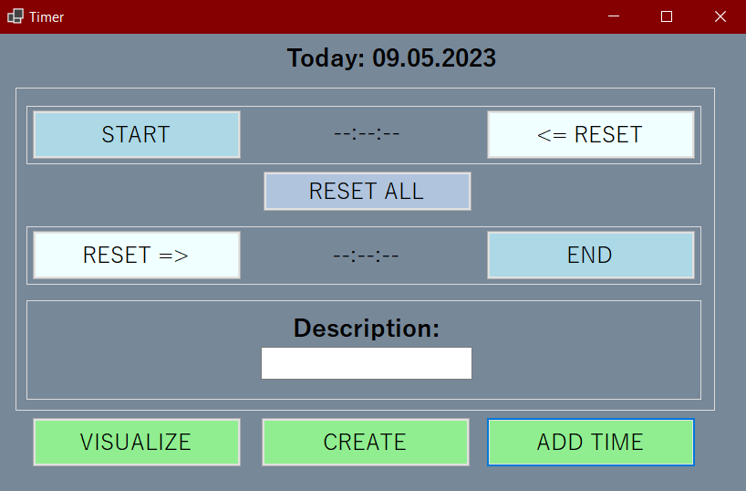
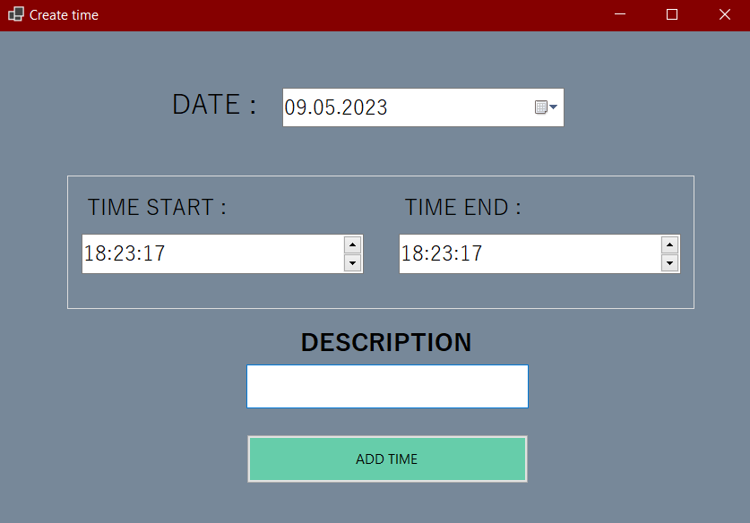

# TimerWinForms
It is a project "Timer", that can help you to track your time and add it to database.
____
## Technologies used
- Windows Forms
- Entity Framework
- MSSQL LocalDB
____
## How to use it
### Tracking time

You can use buttons 'START' to set the start time and 'END' to set the end time.
Use 'RESET' to reset all fields or '<= RESET', 'RESET =>' to reset start and end time fields.
Use field 'DESCRIPTION' to write some message about recorded time.
Click the button 'ADD TIME' to add it to your database.

If you want to write your own time, click the button 'CREATE'

Select date and start + end time. Click the button 'ADD TIME' to add it to your database.

If you wanna check your data, you need to go back and click the button 'VISUALIZE'.

____
## TODO:
- [X] Make a form to create my own time
- [X] Write form to visualize DB
- [ ] Delete object from database in "Visualize"
- [ ] Notifications to Telegram about added time
- [ ] Notifications only with selected description
- [ ] Statistics about wasted time
